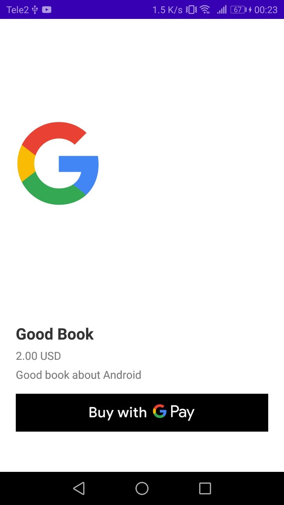

## Example with wrapper module (pay-lib) for using Google Pay Api in one-step

This example is an attempt to make a simpler and more refined example of using the [Google Pay API](https://developers.google.com/pay/api/android/guides/tutorial)
than in the [google-pay/android-quickstart](https://github.com/google-pay/android-quickstart) project (unfortunately, a lot of unstructured constants
and json-objects (that can be encapsulated) can confuse a beginner).

This example is primarily suitable for digital purchases when you decide to use your bank's processing.
For start payment you should
```
    /* get this data from your bank */
    val merchantData = MerchantData(
        merchantName = "example",
        gateway = "example",
        gatewayMerchantId = "example"
    )

    /* data about current item payment */
    val paymentRequest = PaymentRequest(
        itemToBuy.name, itemToBuy.description, itemToBuy.priceCents,
        "USD", "US"
    )

    /* start Activity and enjoy */
    PaymentActivity.openPaymentActivity(
                    applicationContext,
                    merchantData,
                    paymentRequest,
                    isTest
                )
```

{:height="50%" width="50%"}
{:height="50%" width="50%"}
